<div align="center">

# 🛰️ Sentinel-2 Super-Resolution Mapping (SRM) Engine

**4× super-resolution of Sentinel-2 surface reflectance (10 m → 2.5 m) with per-pixel uncertainty, physics-aware losses and a three-tier validation framework.**

[](#executive-overview)
[](environment.yml)
[](environment.yml)
[-138808)](CONTRACTS.md)
[](#testing)
[](pyproject.toml)
[](#implementation-overview)

[Overview](#executive-overview) ·
[Implementation](#implementation-overview) ·
[Contract](#the-interface-contract) ·
[Architecture](#system-architecture) ·
[Models](#model-ladder) ·
[Losses](#loss-functions-and-physical-checks) ·
[Validation](#three-tier-validation) ·
[Quick start](#quick-start) ·
[Demo app](#interactive-demo-app) ·
[Dashboard](#-interactive-web-dashboard--visual-demos) ·
[Roadmap](#roadmap) ·
[Model card](#model-card-and-responsible-use)

</div>

---

## Executive overview

**Problem.** Sub-5 m optical imagery from commercial constellations is expensive for continuous, country-scale public-sector use. ESA's Sentinel-2 is free, open and revisits every ~5 days, but its visible and near-infrared bands are limited to 10 m ground sampling distance. Field boundaries, small buildings, narrow roads and canals are only a few pixels wide at that scale.

**Approach.** SRM is a research-grade, test-driven pipeline that learns a **4× spatial upscaling** of the four 10 m Sentinel-2 bands **B2, B3, B4, B8** (Blue, Green, Red, NIR) and returns, alongside the super-resolved image, a **per-pixel, per-band log-variance map**. The output is designed so that downstream users can see *where the model is guessing*, instead of receiving a sharp but unqualified image.

```
   Input  (10 m, Sentinel-2 L2A)                     Output  (2.5 m product)
   ┌─────────────────────────────────┐   4× SR     ┌─────────────────────────────────────┐
   │ lr  (B, 4,  64,  64)            │ ──────────► │ sr      (B, 4, 256, 256)   in [0, 1] │
   │ [B2 B3 B4 B8], reflectance 0..1 │   model     │ logvar  (B, 4, 256, 256)   log σ²    │
   └─────────────────────────────────┘             └─────────────────────────────────────┘
```

**Intended national use cases:**

| Domain | What 2.5 m + uncertainty is meant to support |
|---|---|
| Agriculture | Smallholder parcel delineation, intra-field vegetation-stress mapping (NDVI), crop-insurance evidence workflows |
| Urban planning & infrastructure | Building-footprint and road extraction, informal-settlement monitoring, asset tracking for urban local bodies |
| Disaster response | Flood extent and embankment-breach mapping via NDWI on river basins such as the Kosi and Brahmaputra |

> [!IMPORTANT]
> Sentinel-2 has no native 2.5 m ground truth. Training uses degraded-resolution pairs (see [Training protocol](#training-protocol-and-its-limits)), so the 10 m → 2.5 m step is a **scale-transfer extrapolation**. Treat every output as a model estimate, and use the uncertainty band together with independent verification before any operational decision.

---

## Implementation overview

The repository contains the full super-resolution pipeline: interface contract, data pipeline, three model families, loss library, evaluation metrics, export path and a demo application, all covered by an automated test suite.

| Area | Module | State |
|---|---|---|
| Interface contract (shapes, band order, radiometry, output dict, product layout) | `srm/contracts.py` | ✅ Implemented, tested |
| STAC search, band download, DN→reflectance, patch extraction | `srm/data/fetcher.py` | ✅ Implemented, tested |
| Dataset, SCL cloud filtering, degradation simulator | `srm/data/dataset.py`, `degradation.py` | ✅ Implemented, tested |
| M0 Bicubic, M1 RRDB, M2 SwinIR | `srm/models/` | ✅ Implemented, forward/backward tested |
| Losses: L1, SAM, heteroscedastic, optional perceptual | `srm/train/losses.py` | ✅ Implemented, tested |
| Training loop (AdamW, cosine LR, AMP, checkpointing) | `srm/train/train.py` | ✅ Implemented |
| Tier 1 metrics (PSNR, SSIM, SAM, ERGAS) and evaluation harness | `srm/eval/metrics.py`, `evaluator.py` | ✅ Implemented, tested |
| Tier 2 physical checks (ΔNDVI, NDWI, downsampling consistency) | `srm/eval/spectral_verifier.py` | ✅ Implemented, tested |
| Tier 3 downstream scoring (mIoU, macro-F1) | `srm/eval/downstream.py` | ✅ Implemented, tested |
| ONNX export | `srm/serve/export_onnx.py` | ✅ Implemented, tested |
| 5-band Cloud-Optimized GeoTIFF product layout | `contracts.assemble_product_array` + e2e test | ✅ Array assembly and layout verified |
| Streamlit demo | `srm/apps/app.py` | ✅ Demo mode (see [Interactive demo app](#interactive-demo-app)) |

Pretrained checkpoints and benchmark results are the next milestone (see [Roadmap](#roadmap)); the repository ships the complete pipeline and evaluation harness rather than pretrained weights.

---

## Key features

- **Fixed, padding-free 4× scale.** 32→128 for training and 64→256 for inference tiles. All sizes are power-of-two friendly, which removes the replicate-pad and crop hacks of the earlier 5× prototype ([ADR-0001](DECISIONS.md)).
- **Spectral integrity by construction.** Only `[B2, B3, B4, B8]` are used, in a frozen order, as float32 surface reflectance clipped to `[0, 1]`. Channel-shuffle augmentation was deliberately removed because it destroys NIR/red semantics ([ADR-0002](DECISIONS.md)).
- **Heteroscedastic uncertainty head.** The SwinIR model has a dedicated head predicting `log σ²` per pixel and band, paired with an attenuated-L1 objective. A scalar `sigma_bar` summary is defined in the contract.
- **Physics-aware objectives and checks.** Spectral Angle Mapper loss; NDVI conservation and downsampling consistency (`D₄(SR) ≈ LR`) as a Tier 2 verification stage.
- **Contract-first engineering.** Every module boundary is validated by executable checks (`validate_pair`, `validate_model_output`), with a versioned interface spec and append-only decision records.
- **Three-tier validation.** Image fidelity, physical consistency and downstream task utility are evaluated separately, so a pretty image cannot mask a spectrally wrong one.

---

## The interface contract

`CONTRACTS.md` (v1.0.0, frozen) is the source of truth, mirrored in code by `srm/contracts.py`. Changes require an ADR and an integrator-approved PR.

| ID | Rule |
|---|---|
| **C1** Band order | `[B2, B3, B4, B8]` everywhere: files, tensors, model I/O, product. Never permuted. |
| **C2** Radiometry | `float32`, ρ = DN / 10000, clipped to `[0, 1]`, no NaN/Inf across module boundaries. Only the dataset layer converts DN→reflectance. |
| **C3** Shapes | Scale is exactly 4. Train: `(B,4,32,32) → (B,4,128,128)`. Inference tile: `(B,4,64,64) → (B,4,256,256)`. NCHW. |
| **C4** Model API | `model(lr)` returns `{"sr": (B,4,4h,4w), "logvar": (B,4,4h,4w)}`. Per-pixel uncertainty summary: `sigma_bar = mean_over_bands(exp(0.5·logvar))`. |
| **C5** Product | 5-band float32 COG: `B2, B3, B4, B8, sigma_bar`. Pixel size is ¼ of the source (10 m → 2.5 m); CRS inherited; origin unchanged. |
| **C6** Ownership | Only the integrator edits the contract, via issue → ADR → PR. |

```python
from srm.contracts import validate_model_output, sigma_bar, assemble_product_array
```

---

## System architecture

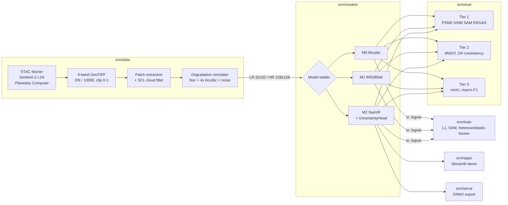

### Repository layout

```text
srm_project/
├── CONTRACTS.md              # Frozen interface contract v1.0.0 (C1–C6)
├── DECISIONS.md              # Append-only ADRs (4× scale, no spectral shuffle)
├── STATE.md                  # Workstream status board (A0–A9)
├── CODEOWNERS                # Review ownership per module
├── Makefile                  # setup / lint / test / e2e (conda-based)
├── environment.yml           # Pinned conda environment (Python 3.11, torch 2.4.1)
├── pyproject.toml            # ruff + pytest configuration
├── configs/
│   ├── data.yaml             # bands, scale, tile sizes, degradation ranges
│   ├── model_m1.yaml         # RRDB configuration
│   ├── model_m2.yaml         # M2 configuration
│   ├── eval.yaml             # metric selection
│   └── serve.yaml            # COG product settings (DEFLATE, predictor 3)
├── srm/
│   ├── contracts.py          # Executable contract: validators, sigma_bar, product assembly
│   ├── data/
│   │   ├── fetcher.py        # SentinelSTACFetcher: search, download, patch extraction
│   │   ├── dataset.py        # SRMDataset, SCL quality filter, create_dataloaders
│   │   └── degradation.py    # SRMDegradation: blur → 4× bicubic (antialiased) → noise
│   ├── models/
│   │   ├── m0_bicubic.py     # M0 baseline
│   │   ├── m1_rrdb.py        # M1 RRDBNet
│   │   ├── m2_swin.py        # M2 SwinIR (RSTB blocks) + uncertainty head
│   │   ├── heads.py          # UncertaintyHead
│   │   └── __init__.py       # build_model() factory
│   ├── train/
│   │   ├── losses.py         # SAMLoss, HeteroscedasticLoss, PerceptualLoss, SRMCompoundLoss
│   │   └── train.py          # AdamW + cosine LR + AMP + checkpointing
│   ├── eval/
│   │   ├── metrics.py        # PSNR, SSIM, SAM, ERGAS
│   │   ├── evaluator.py      # SRMEvaluator: dataloader → mean/std report (JSON)
│   │   ├── spectral_verifier.py  # Tier 2: NDVI/NDWI, D4 consistency
│   │   └── downstream.py     # Tier 3: mIoU, macro-F1
│   ├── serve/export_onnx.py  # ModelWrapper + export_to_onnx
│   ├── apps/app.py           # Streamlit demo
│   ├── web/                  # Reserved for the web front end
│   └── legacy/               # Earlier 5× prototype (read-only reference, excluded from CI/lint)
└── tests/                    # pytest suite (contracts, data, models, eval, deploy, e2e)
```

---

## Model ladder

Models are built through a single factory, `build_model(name_or_config)`. Every model returns a dict containing `sr`; uncertainty-aware models also return `logvar`.

| Rung | Class | Description | Uncertainty |
|---|---|---|---|
| **M0** | `BicubicModel` | Non-trainable 4× bicubic interpolation. The lower bound every learned model must beat. | deterministic baseline |
| **M1** | `RRDBNet` | Residual-in-Residual Dense Block network: shallow conv → *N* RRDB blocks (3 dense blocks each, growth channels `gc=32`) → two ×2 PixelShuffle stages → conv head. Defaults: 64 filters, 6 blocks. | deterministic |
| **M2** | `SwinIRNet` (`SRMSwinIR`) | SwinIR-style backbone: shallow conv → 3 Residual Swin Transformer Blocks (4 layers, 4 heads each, 8×8 windows, alternating shifted windows with attention masks, relative position bias) → 4× PixelShuffle upsampler → **dual heads**: `sr_head` and `UncertaintyHead`. Defaults: `embed_dim=64`, `mlp_ratio=2`. | ✅ `logvar` per pixel and band |

```python
from srm.models import build_model

m0 = build_model("m0")
m1 = build_model({"name": "m1", "num_filters": 64, "num_blocks": 6})
m2 = build_model("m2")
```

---

## Training protocol and its limits

- **Pairs are synthetic (Wald-style).** Real 10 m Sentinel-2 crops are treated as high-resolution targets (`128×128`). Low-resolution inputs (`32×32`) are produced by `SRMDegradation`: Gaussian blur (kernel 3, σ 0.5) → antialiased 4× bicubic downsampling → optional Gaussian noise → clip to `[0, 1]`.
- **Quality filtering.** When a Scene Classification Layer (SCL) mask is supplied, a patch is rejected if ≥10 % of its pixels fall in invalid classes: no-data (0), saturated/defective (1), cloud shadow (3), medium/high-probability cloud (8, 9), thin cirrus (10).
- **Augmentation.** Flips and 90° rotations only. Spectral shuffling is forbidden (ADR-0002).
- **Scale-transfer assumption.** The model learns 40 m → 10 m and is then applied to 10 m → 2.5 m. Whether the learned prior transfers is an *empirical question this project sets out to answer*, ideally against genuine 2.5 m or finer reference imagery (aerial, drone or commercial). Until then, high-frequency detail in the product should be regarded as plausible, not measured.

---

## Loss functions and physical checks

Notation: predicted SR $\hat{y}$, target $y$, predicted log-variance $s=\log\sigma^2$, spectral vector at pixel $i$ over the four bands $\hat{y}_i, y_i \in \mathbb{R}^4$.

### Training losses (`srm/train/losses.py`)

**Spectral Angle Mapper (SAM) loss**, in radians:

$$
\mathcal{L}_{\text{SAM}}=\frac{1}{N}\sum_{i=1}^{N}\arccos\!\left(\operatorname{clip}\!\left(\frac{\hat{y}_i\cdot y_i}{\lVert\hat{y}_i\rVert_2\,\lVert y_i\rVert_2+\epsilon},\,-1+\epsilon,\,1-\epsilon\right)\right)
$$

**Heteroscedastic (attenuated-L1) uncertainty loss** — pixels the model is unsure about are down-weighted by $e^{-s}$, and the $+s$ term prevents the trivial solution of predicting infinite variance:

$$
\mathcal{L}_{\text{unc}}=\frac{1}{CHW}\sum_{c,h,w}\left(\tfrac{1}{2}\,e^{-s_{c,h,w}}\,\bigl|y_{c,h,w}-\hat{y}_{c,h,w}\bigr|+\tfrac{1}{2}\,s_{c,h,w}\right)
$$

**Compound loss** (`SRMCompoundLoss`), with defaults $w_{1}=1,\;w_{\text{SAM}}=0.1,\;w_{\text{unc}}=1,\;w_{\text{perc}}=0$:

$$
\mathcal{L}=w_{1}\,\mathcal{L}_{1}+w_{\text{SAM}}\,\mathcal{L}_{\text{SAM}}+w_{\text{unc}}\,\mathcal{L}_{\text{unc}}+w_{\text{perc}}\,\mathcal{L}_{\text{perc}}
$$

$\mathcal{L}_{\text{perc}}$ is an optional VGG16 feature loss on the `[B4, B3, B2]` composite and is disabled by default.

### Physical-consistency checks (`srm/eval/spectral_verifier.py`)

Implemented as **Tier 2 verification**, computed after inference.

$$
\text{NDVI}(X)=\frac{X_{\text{NIR}}-X_{\text{Red}}}{X_{\text{NIR}}+X_{\text{Red}}+\epsilon},\qquad
\text{NDWI}(X)=\frac{X_{\text{Green}}-X_{\text{NIR}}}{X_{\text{Green}}+X_{\text{NIR}}+\epsilon}
$$

$$
\Delta\text{NDVI}=\operatorname{mean}\bigl|\,\text{NDVI}\!\left(D_4(\widehat{Y})\right)-\text{NDVI}(X_{\text{LR}})\,\bigr|,\qquad
D_4=\text{4×4 average pooling}
$$

The default pass criterion is $\Delta\text{NDVI}<0.02$. The verifier additionally reports per-band and mean reflectance MAE between $D_4(\widehat{Y})$ and $X_{\text{LR}}$ (the downsampling-consistency residual).

---

## Three-tier validation

| Tier | Question | Implementation | Metrics |
|---|---|---|---|
| **1. Spatial & spectral fidelity** | Does SR look like the reference? | `compute_all_metrics`, `SRMEvaluator` | PSNR (overall + per band), SSIM (11×11 Gaussian, σ 1.5), SAM (degrees), ERGAS (scale 4) |
| **2. Physical consistency** | Is it radiometrically honest? | `SpectralConservationVerifier` | ΔNDVI (< 0.02), NDWI, `D₄(SR) ≈ LR` residual per band |
| **3. Downstream utility** | Is it more *useful* for real tasks? | `DownstreamEvaluator` | Segmentation mIoU, macro-F1 for land-cover classification |

`SRMEvaluator.evaluate()` returns `{metric: {"mean", "std"}}` over a dataloader and `export_report()` writes it to JSON. The Tier 3 scorers accept predicted masks or labels from any downstream model, so the same scoring code applies to every rung of the model ladder.

---

## Evaluation protocol

Every rung of the ladder is scored with the same harness, so M1 and M2 are always reported against the M0 bicubic baseline on identical patches. The reported columns are PSNR (dB), SSIM, SAM (°), ERGAS, ΔNDVI and segmentation mIoU.

**Evaluating a checkpoint** (real tiles → patches → evaluator):

```python
import torch
from torch.utils.data import DataLoader
from srm.data import SentinelSTACFetcher, SRMDataset
from srm.eval import SRMEvaluator
from srm.models import build_model

fetcher = SentinelSTACFetcher()
items = fetcher.search_scenes(bbox=[77.55, 12.93, 77.65, 13.03],
                              datetime_range="2026-03-01/2026-04-30",
                              max_cloud_cover=10, limit=3)
tif = fetcher.download_tile_bands(items[0], output_dir="data/raw_tiles")
patches = fetcher.extract_patches(tif, patch_size=128, stride=128)   # (N, 4, 128, 128)

loader = DataLoader(SRMDataset(data=patches), batch_size=4)
model = build_model("m2")
model.load_state_dict(torch.load("checkpoints/best_model.pt", map_location="cpu")["model_state_dict"])

summary = SRMEvaluator(model, loader).evaluate()
print(summary)
```

Results are reported on scenes and regions **held out** from training, and a Tier 3 row is added only for a downstream model that was itself trained or evaluated on independent labels.

---

## Quick start

**Prerequisites:** Python 3.11, [conda](https://docs.conda.io/) (or Miniforge). A CUDA GPU is optional; CPU works for tests and demos.

<details open>
<summary><b>Windows (PowerShell)</b></summary>

```powershell
git clone https://github.com/DivyanshPrakashIIT/srm_project.git
cd srm_project

conda env create -n srm -f environment.yml
conda activate srm

# Demo app and ONNX tooling
pip install streamlit matplotlib onnx onnxruntime

# GPU users on Windows: install the CUDA build of PyTorch first
# pip install torch==2.4.1 torchvision==0.19.1 --index-url https://download.pytorch.org/whl/cu124
```
</details>

<details>
<summary><b>Linux / macOS (Bash)</b></summary>

```bash
git clone https://github.com/DivyanshPrakashIIT/srm_project.git
cd srm_project

make setup                      # creates/updates the `srm` conda env from environment.yml
conda activate srm
pip install streamlit matplotlib onnx onnxruntime
```
</details>

### Testing

```bash
pytest -m "not e2e"     # unit tests           (same as: make test)
pytest -m e2e -v        # synthetic tile → 5-band COG contract check  (same as: make e2e)
ruff check srm tests    # lint                 (same as: make lint)
```

Tests that need optional dependencies (`onnx`, `onnxruntime`, a GDAL build with the COG driver) skip automatically when those are missing. No network access or GPU is required.

| Test module | Covers |
|---|---|
| `test_contracts.py` | Band order, DN→reflectance, range/dtype/NaN rejection, 4× pair validation (5×, padded and odd crops are rejected), model-output validation, `sigma_bar`, product layout |
| `test_dataset.py` | Shapes and batching, value range, determinism, SCL filtering, dataloader creation |
| `test_fetcher.py` | STAC query parameters, band mapping and scaling, patch extraction |
| `test_models.py` | M0/M1 output shapes and keys, backpropagation, loss reduction, factory |
| `test_a4_models.py` | Uncertainty head, SwinIR forward/shapes, factory, SAM / heteroscedastic / compound losses |
| `test_eval.py` | Perfect-reconstruction and noisy-input metrics, individual metric functions, evaluator report |
| `test_a5_downstream.py` | mIoU, macro-F1, NDVI/NDWI bounds, D₄ aggregation, conservation threshold |
| `test_a7_deploy.py` | ONNX wrapper, export, ONNX Runtime execution, spectral-index helpers, app inference path |
| `test_e2e_synthetic.py` | Synthetic tile → model → 5-band COG → read-back contract check |

### Run a model end to end

```python
import torch
from srm.models import build_model
from srm.contracts import validate_model_output, sigma_bar, assemble_product_array

model = build_model("m2").eval()          # random weights until you load a checkpoint
lr = torch.rand(1, 4, 64, 64)             # 10 m tile, reflectance in [0, 1]

with torch.no_grad():
    out = model(lr)
out["sr"] = out["sr"].clamp(0, 1)         # models do not clamp; the contract requires [0, 1]

validate_model_output(out, lr)            # sr: (1,4,256,256), logvar: same shape, finite
sigma = sigma_bar(out["logvar"])          # (1,1,256,256) mean per-pixel σ
product = assemble_product_array(out["sr"], out["logvar"])   # (5,256,256) float32
```

### Train

```bash
python -m srm.train.train --config configs/model_m1.yaml
```

The loop uses AdamW, cosine annealing and mixed precision on CUDA, and writes `latest_model.pt` and `best_model.pt` to `checkpoints/`.

### Export to ONNX

```python
from srm.models import build_model
from srm.serve import export_to_onnx

export_to_onnx(build_model("m2"), "outputs/srm_m2.onnx", dummy_input_shape=(1, 4, 32, 32))
# ONNX inputs/outputs: "input" -> "sr", "logvar" (dynamic batch axis)
```

---

## Interactive demo app

```powershell
py -m streamlit run srm/apps/app.py      # Windows
```
```bash
streamlit run srm/apps/app.py            # Linux / macOS
```

Open <http://localhost:8501>.

**What it does**

- Loads an uploaded patch, or a built-in synthetic 4-band patch if none is provided.
- Shows the **10 m input** and **2.5 m output** RGB composites side by side.
- Renders an **uncertainty map** and optional **NDVI / NDWI overlays**.

**Input format for uploads:** `.npy` or `.npz` containing a 4-channel array shaped `(4, H, W)` or `(H, W, 4)`, ordered `[B2, B3, B4, B8]` and **already scaled to reflectance in `[0, 1]`** (the app does not divide by 10000).

> [!NOTE]
> The app runs in **demo mode**. The bicubic option is exact. The learned-model options ("RRDB-L1 (ONNX)", "SwinIR (ONNX)") use bicubic upscaling with an illustrative, gradient-based uncertainty overlay until trained checkpoints are connected, so the displayed uncertainty is **not model-derived** in this build.

---

## 📱 Interactive Web Dashboard & Visual Demos

The Streamlit dashboard (`srm/apps/app.py`) puts the whole pipeline in one screen: pick an area of interest, pick a model rung, pick a display mode, and inspect the 10 m input against the 2.5 m output. This section is a visual tour of that interface.

**Dashboard layout**

| Region | Controls / content |
|---|---|
| **Sidebar: Control & AOI Configuration** | *Target Indian AOI Presets* (Punjab Agriculture Belt, Delhi NCR Urban Region, Kosi River Basin) · *Model Architecture Selector* (M0 bicubic, M1 RRDB-L1, M2 SwinIR) · *Display Composite Mode* (True Color RGB `B4,B3,B2`, False Color NIR `B8,B4,B3`, NDVI Index Map, Heteroscedastic Uncertainty σ) |
| **Sidebar: Physical Constraints & Verification** | *Downsampling Consistency Check* toggle · *Confidence Mask Threshold* slider (0.90 in every screenshot below) |
| **Tab 1: 10m vs 2.5m Comparison** | Side-by-side input and output for the selected AOI and display mode |
| **Tab 2: Spectral & Physical Integrity** | Uncertainty map (σ) and NDVI distribution-preservation histogram |
| **Tab 3: Downstream Applications** | Agriculture, urban-planning and disaster-management views |

> [!IMPORTANT]
> **How to read these screenshots.** The dashboard runs in **demo mode** (see the note in [Interactive demo app](#interactive-demo-app)). The AOI presets are built-in demo patches, the comparison views use the exact **M0 bicubic** baseline, and for the learned-model options the σ overlay is illustrative and **not model-derived** in this build. The figures show what the interface does, and they are **not** benchmark results. Trained-checkpoint results are tracked in the [Roadmap](#roadmap).

**Figure index**

| Figures | Feature | AOI |
|---|---|---|
| 1 – 3 | [10m vs 2.5m Comparative Inspection](#1-10m-vs-25m-comparative-inspection) | Punjab Agriculture Belt |
| 4 – 6 | [10m vs 2.5m Comparative Inspection](#1-10m-vs-25m-comparative-inspection) | Delhi NCR Urban Region |
| 7 – 9 | [10m vs 2.5m Comparative Inspection](#1-10m-vs-25m-comparative-inspection) | Kosi River Basin |
| 10 – 11 | [Physical Spectral Conservation & Variance Mapping](#2-physical-spectral-conservation--variance-mapping) | Kosi River Basin, Delhi NCR |
| 12 – 13 | [Downstream Governance Applications](#3-downstream-governance-applications) | Punjab Agriculture Belt, Kosi River Basin |

---

### 1. 10m vs 2.5m Comparative Inspection

Each AOI is shown as a **10 m native patch (left)** next to the **2.5 m output (right)**, for the same patch, under three display modes. All views below use **M0: Bicubic Baseline (4×)**, so the right-hand panel is the reference every learned model has to beat.

#### 1.1 Punjab Agriculture Belt (Crop Fields)

**Figure 1 · Punjab, True Color RGB (B4, B3, B2)**

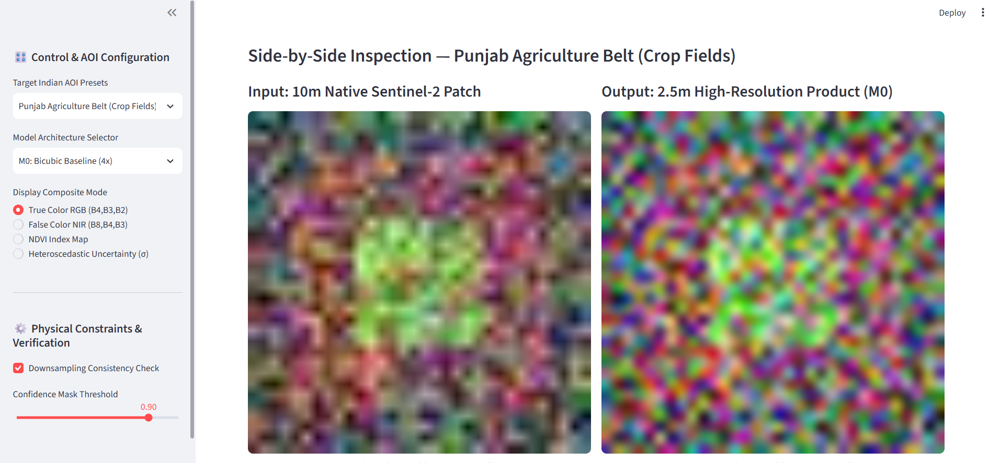

> 📌 **Fig. 1.** Side-by-side true-colour composite for the crop-field preset. Left: 10 m native patch (32×32 grid). Right: 2.5 m product (128×128 grid) from the M0 bicubic baseline. The green vegetated patch is visible in both panels.

| **Figure 2 · False Color NIR (B8, B4, B3)** | **Figure 3 · NDVI Index Map** |
|:---:|:---:|
| 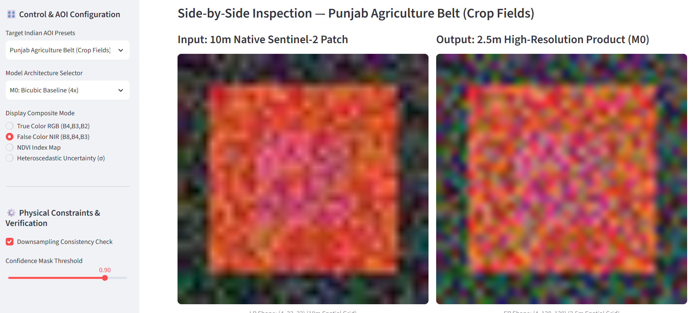 | 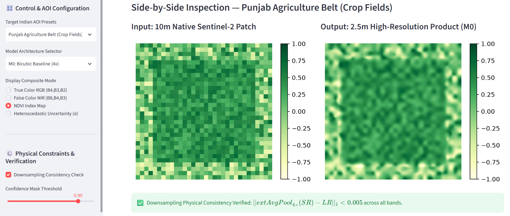 |
| 📌 **Fig. 2.** In the NIR false-colour composite the central parcel stands out in red/pink against a dark surround, the usual signature of actively growing vegetation. | 📌 **Fig. 3.** NDVI on a −1 → 1 green ramp. The parcel carries higher NDVI than its surround. The banner underneath reports the *Downsampling Consistency Check* for `AvgPool₄ₓ(SR)` against the 10 m input. |

#### 1.2 Delhi NCR Urban Region (Buildings)

**Figure 4 · Delhi NCR, True Color RGB (B4, B3, B2)**

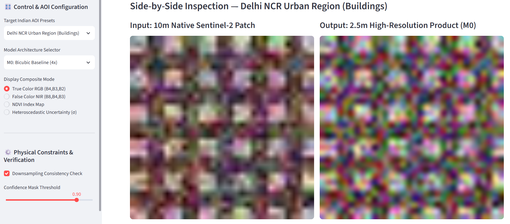

> 📌 **Fig. 4.** The urban preset is a repeating pattern of bright blocks on a darker background that stands in for building footprints. At 10 m each block is only a few pixels wide, which is exactly the regime 2.5 m products are meant to help with.

| **Figure 5 · False Color NIR (B8, B4, B3)** | **Figure 6 · NDVI Index Map** |
|:---:|:---:|
| 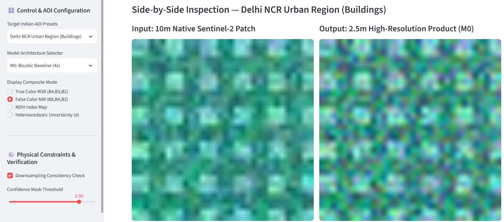 | 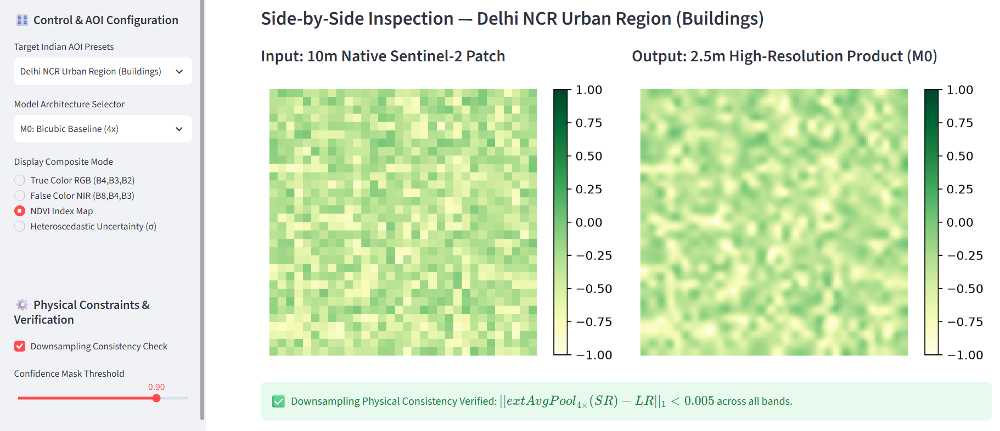 |
| 📌 **Fig. 5.** The block structure remains visible in the NIR composite, with the 2.5 m output showing the smoother transitions typical of bicubic interpolation. | 📌 **Fig. 6.** NDVI stays uniformly low across the built-up patch (pale green), in contrast to the vegetated Punjab preset in Figure 3. |

#### 1.3 Kosi River Basin (Flood Hazard)

**Figure 7 · Kosi Basin, True Color RGB (B4, B3, B2)**

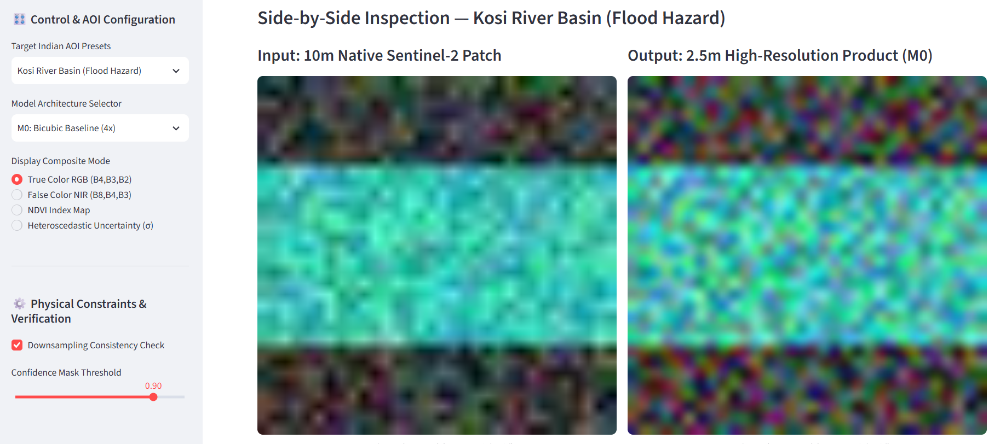

> 📌 **Fig. 7.** The flood-hazard preset contains a broad horizontal river channel (cyan) between darker banks. Water/land contrast is strong in both panels, and this is the scene the NDWI mask in [Figure 13](#3-downstream-governance-applications) is derived from.

| **Figure 8 · False Color NIR (B8, B4, B3)** | **Figure 9 · NDVI Index Map** |
|:---:|:---:|
| 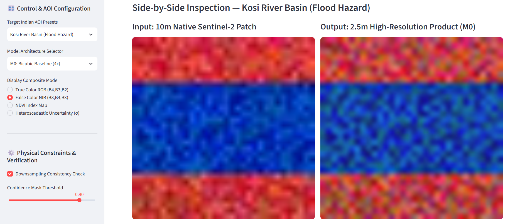 | 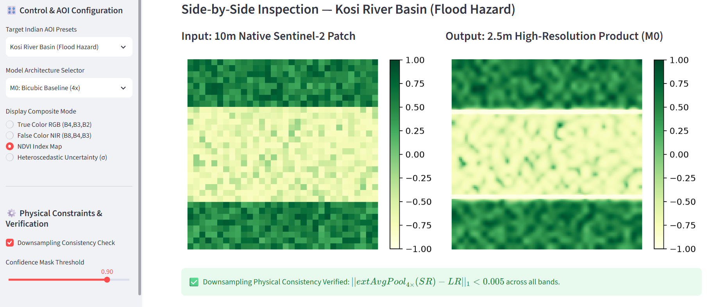 |
| 📌 **Fig. 8.** Water absorbs NIR, so the channel appears deep blue while the vegetated banks appear red. | 📌 **Fig. 9.** The channel is near the bottom of the NDVI scale (pale) and the banks are dark green, giving the cleanest two-class separation of the three AOIs. |

---

### 2. Physical Spectral Conservation & Variance Mapping

The **Spectral & Physical Integrity** tab pairs two panels. The **Heteroscedastic Uncertainty Map (σ)** shows the per-pixel standard deviation that the [`sigma_bar`](#the-interface-contract) summary (C4/C5) is defined to carry. The **NDVI Index Distribution Preservation** histogram overlays the NDVI distribution of the 10 m native input on that of the 2.5 m output. These are the two views behind the Tier 2 physical-consistency idea in [Three-tier validation](#three-tier-validation), where the goal is ΔNDVI < 0.02.

**Figure 10 · Kosi River Basin, M1: RRDB-L1**

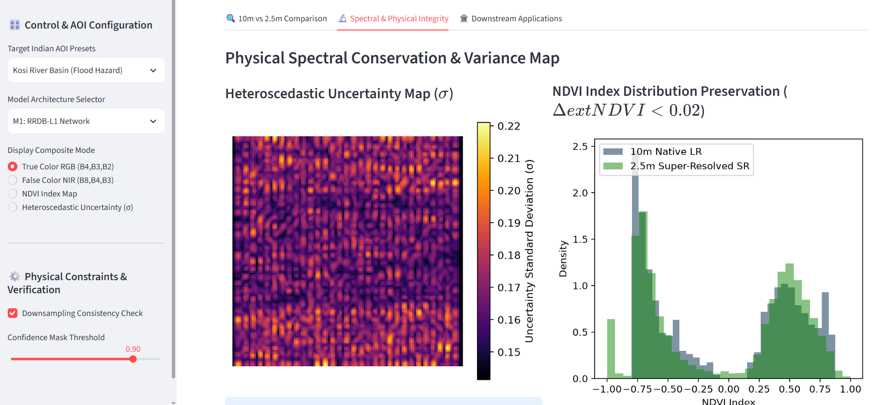

> 📌 **Fig. 10.** *Left:* σ heatmap on an inferno colour scale (about 0.14 – 0.22 in this run). *Right:* overlaid NDVI histograms of the 10 m native LR input (grey-blue) and the 2.5 m super-resolved output (green). The bimodal shape (a water mode at strongly negative NDVI and a vegetation mode at positive NDVI) is reproduced by the 2.5 m output, with small differences in the tails.

**Figure 11 · Delhi NCR Urban Region, M1: RRDB-L1**

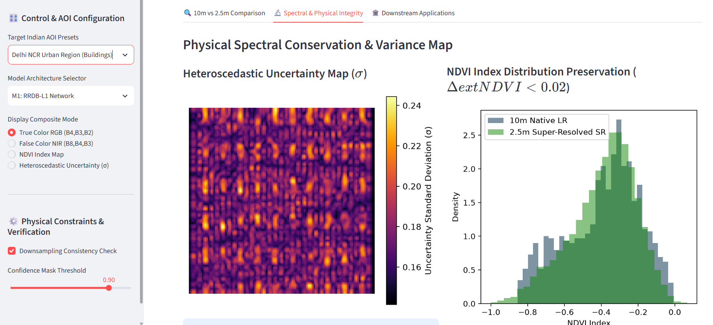

> 📌 **Fig. 11.** Same panels for the urban preset. σ shows a periodic, block-aligned structure (about 0.15 – 0.24), and the NDVI histogram is unimodal around −0.3 with the two distributions closely overlapping.

> [!NOTE]
> In this build the σ maps in Figures 10 and 11 are the demo's **illustrative, gradient-based overlay**, not the output of a trained `UncertaintyHead`. Calibration of a real uncertainty head (reliability diagrams, error-vs-σ correlation) is Roadmap items [#2 and #4](#roadmap).

---

### 3. Downstream Governance Applications

The **Downstream Applications** tab connects the 2.5 m product to the [intended national use cases](#executive-overview): parcel-level agriculture, urban planning and disaster response. Two of its views are shown here.

**Figure 12 · Sub-Field Crop Parcel Delineation (Punjab Agriculture Belt)**

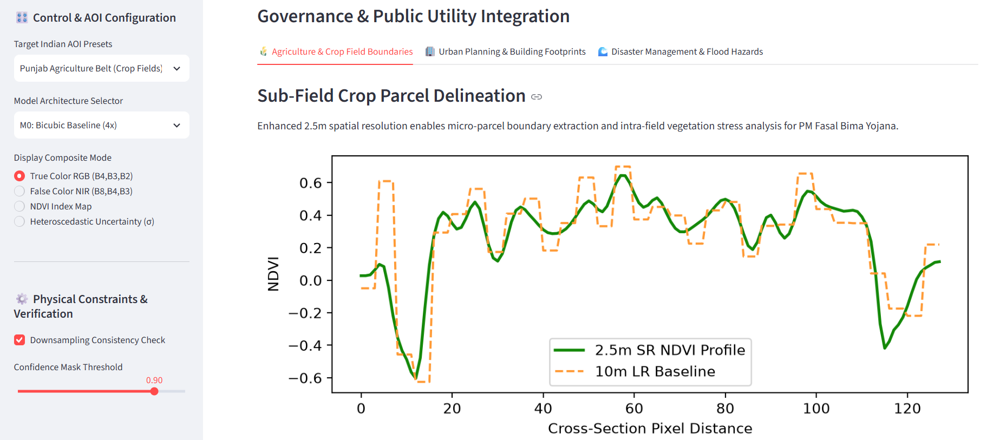

> 📌 **Fig. 12.** An NDVI **cross-section profile** through the patch (x-axis: pixel distance along the transect, y-axis: NDVI). The solid green line is the 2.5 m SR profile and the dashed orange line is the 10 m LR baseline. The 10 m profile is a coarse step function, while the 2.5 m profile draws the same transitions (field edges, intra-field dips) as a smooth curve at finer sampling. With the M0 baseline this is interpolation, so it shows the workflow rather than added detail; recovered detail is what the trained M1/M2 models are meant to contribute.

**Figure 13 · Flood Hazard Inundation Mapping (Kosi Basin)**

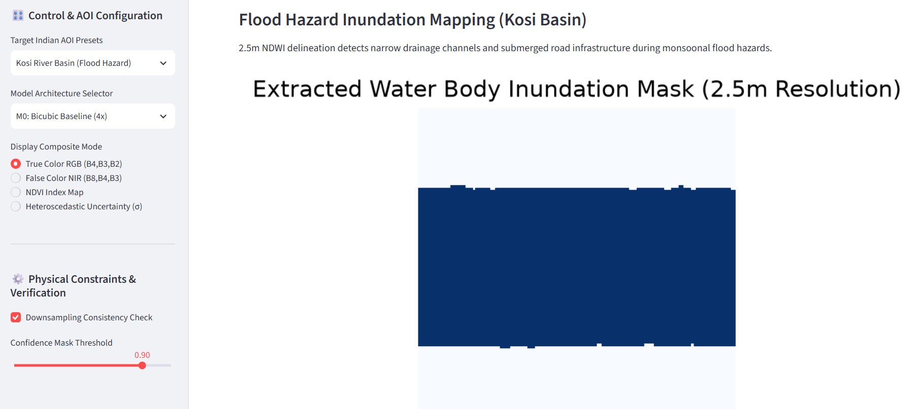

> 📌 **Fig. 13.** Binary **NDWI-derived water-body mask** at 2.5 m (dark blue = water, pale = land) for the Kosi preset. The channel is delineated as one contiguous body with a pixel-level, stair-stepped boundary. The same NDWI formula is defined in [Physical-consistency checks](#physical-consistency-checks-srmevalspectral_verifierpy).

> [!WARNING]
> These downstream views are **illustrative demonstrations of the workflow**. Parcel boundaries and inundation extents from this build must not be used for cadastral, insurance-compensation or enforcement decisions (see [Model card and responsible use](#model-card-and-responsible-use)).

---

## Roadmap

| # | Milestone | Plan |
|---|---|---|
| 1 | **Trained models and benchmarks** | Train M1/M2 on a multi-region Sentinel-2 corpus; publish Tier 1–3 results on held-out scenes. |
| 2 | **Compound-loss training** | Train with `SRMCompoundLoss` (L1 + SAM + heteroscedastic) so the uncertainty head is optimised end to end. |
| 3 | **Physics terms as losses** | Add NDVI preservation and downsampling consistency as differentiable loss terms; ablate their effect on ΔNDVI. |
| 4 | **Uncertainty calibration** | Reliability diagrams, error-vs-σ correlation and sparsification curves. |
| 5 | **Perceptual metric** | Add LPIPS to the Tier 1 report. |
| 6 | **App on trained checkpoints** | Wire the demo to trained ONNX/PyTorch models; add GeoTIFF I/O, region presets (Punjab agriculture belt, Delhi NCR, Kosi flood basin) and a swipe/split viewer. |
| 7 | **Production product path** | Tile-wise inference with overlap blending → 5-band COG per C5; batch inference service; web front end in `srm/web/`. |
| 8 | **Repository hygiene** | GitHub Actions workflow running `make lint test e2e`; pin all runtime dependencies in `environment.yml`. |

---

## Model card and responsible use

**Model details.** 4-band, 4× single-image super-resolution models (M1 RRDBNet, M2 SwinIR with uncertainty head) for Sentinel-2 L2A surface reflectance. Interface: `CONTRACTS.md` v1.0.0.

**Intended use.** Visual interpretation support, exploratory analytics, and research on super-resolution and uncertainty for Earth observation: parcel and infrastructure screening, vegetation and water index mapping, and planning-level situational awareness.

**Out-of-scope uses.** Cadastral or legal boundary determination, insurance or compensation adjudication, enforcement, or any decision where a wrong pixel has legal or safety consequences, unless the result is independently verified against ground truth or higher-resolution imagery.

**Anti-hallucination design.**

- *Uncertainty band.* Every SR product carries per-pixel `sigma_bar` (C5, band 5) so users can mask or down-weight low-confidence areas before vectorisation.
- *Physical checks.* Tier 2 verifies that aggregating SR back to 10 m reproduces the input's spectra and NDVI within a set tolerance.
- *Honest baseline.* M0 bicubic is always evaluated alongside learned models to show what, if anything, the network adds.

**Limitations.**

- Learned detail is a *prior-driven estimate*; SR can invent plausible but false structures, especially for small or rare objects. The uncertainty head reduces this risk, but a low σ is not a guarantee until calibration is completed (Roadmap #4).
- Scale-transfer from degraded 40 m→10 m training pairs to 10 m→2.5 m inference must be validated against finer reference imagery.
- Dense cloud, cloud shadow, cirrus, snow/ice and haze corrupt reflectance (particularly NIR) and are only partially removed by SCL filtering; scenes with substantial contamination should be rejected upstream.
- Steep alpine terrain and deep shadow reduce signal-to-noise and are likely to show higher uncertainty.
- Only four bands are handled; red-edge, SWIR and 20/60 m bands are out of scope in v1.
- Performance across India's agro-climatic zones, urban morphologies and water bodies should be tested per region.

---

## Engineering workflow

- **Contract-first:** interface changes need an ADR in `DECISIONS.md` and a version bump in `CONTRACTS.md`.
- **Ownership:** `CODEOWNERS` maps each folder to a workstream (A0 integration · A1–A2 data · A3–A5 models/training · A6 evaluation · A7 apps · A8 serving · A9 web).
- **Quality gates:** `ruff` (line length 100, rules `E,F,I,B`) and `pytest`; `srm/legacy/` is excluded and must not be imported by new code.
- **Status tracking:** owners update their card in `STATE.md` in the same PR as their change.

---

## Contributors

Developed for Smart India Hackathon 2026, Problem Statement 26142, by the SRM team. Maintainer: **Divyansh Prakash** ([@DivyanshPrakashIIT](https://github.com/DivyanshPrakashIIT)). See the [contributors graph](https://github.com/DivyanshPrakashIIT/srm_project/graphs/contributors) for everyone who has committed.

## Citation

```bibtex
@software{prakash_srm_2026,
  author  = {Prakash, Divyansh and {SRM Team}},
  title   = {Sentinel-2 Super-Resolution Mapping (SRM) Engine},
  year    = {2026},
  version = {0.0.1},
  url     = {https://github.com/DivyanshPrakashIIT/srm_project},
  note    = {Smart India Hackathon 2026, Problem Statement 26142}
}
```

## Acknowledgements and references

- Contains modified Copernicus Sentinel data (ESA), accessed through the Microsoft Planetary Computer STAC catalog.
- J. Liang et al., *SwinIR: Image Restoration Using Swin Transformer*, ICCV Workshops 2021.
- X. Wang et al., *ESRGAN: Enhanced Super-Resolution Generative Adversarial Networks*, ECCV Workshops 2018 (RRDB).
- A. Kendall & Y. Gal, *What Uncertainties Do We Need in Bayesian Deep Learning for Computer Vision?*, NeurIPS 2017.
- L. Wald, T. Ranchin, M. Mangolini, *Fusion of satellite images of different spatial resolutions: assessing the quality of resulting images*, Photogrammetric Engineering & Remote Sensing, 1997.
- F. Kruse et al., *The Spectral Image Processing System (SIPS)*, Remote Sensing of Environment, 1993 (Spectral Angle Mapper).

## License

Released under the MIT License. See the `LICENSE` file in the repository root.
